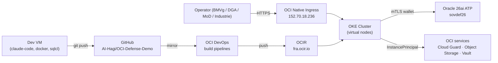
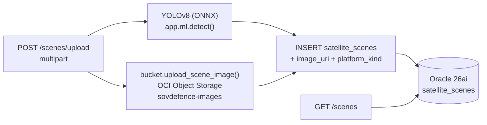
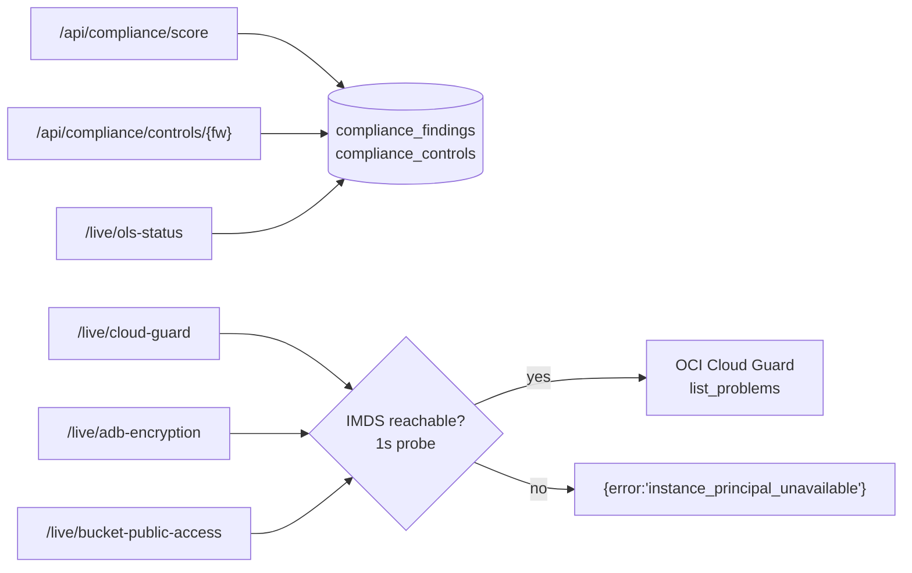
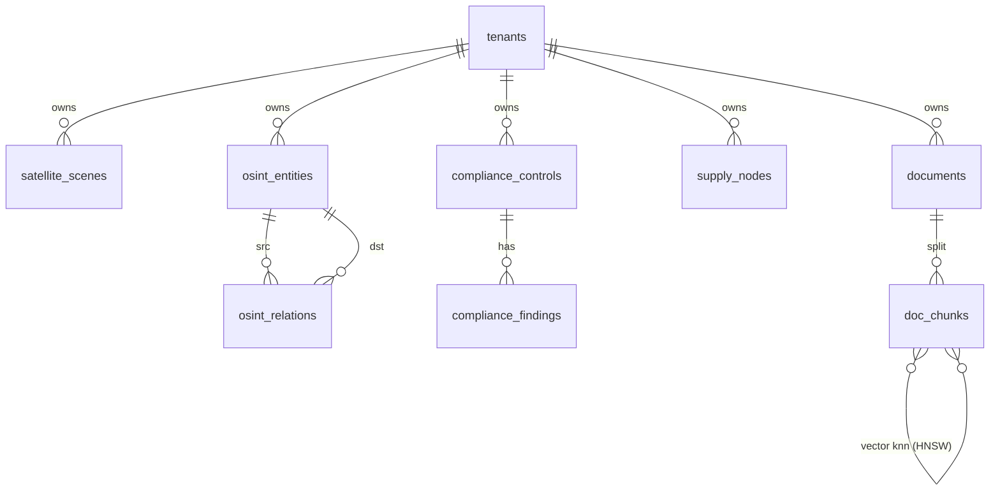

# Architecture — Sovereign Defence Intelligence Platform

C4-style breakdown of the platform as deployed in `eu-frankfurt-1`.
Source-of-truth for layout: `services/`, `frontend/`, `k8s/`,
`crossplane/`, `oci-devops/`, `db/`. Use-case mapping follows
`CLAUDE_DEV9.md` (sections "7 Use Cases" and "Strategischer Bezug").

---

## Level 1 — System context



The platform is a **data + AI backbone** — not a C2 / fires / weapons
system. Connectivity to BMS, mission networks, UAV/cUAS systems is
modelled as an *interface* (see `docs/ECOSYSTEM.md`).

---

## Level 2 — Containers (deployed)

| Container | Image | Port | Use case |
|---|---|---:|---|
| `frontend` | `sovdefence/frontend:latest` | 8080 | All 6 views (UC1–UC6) |
| `geoint` | `sovdefence/geoint:latest` | 8001 | UC1 GEOINT + UAV |
| `doc-intel` | `sovdefence/doc-intel:latest` | 8002 | UC2 Doktrin-RAG |
| `osint` | `sovdefence/osint:latest` | 8003 | UC4 OSINT + EMS |
| `supply-chain` | `sovdefence/supply-chain:latest` | 8004 | UC5 Lieferketten + Risk |
| `compliance` | `sovdefence/compliance:latest` | 8005 | UC6 NIS2/DORA/GDPR/VS-NfD |

Out of scope for v2.0: UC7 Konvergenz-Empfehler (`Preview, v2.1+`).

Ingress paths (`k8s/base/ingress.yaml`):

```
/                         → frontend
/api/geoint/*             → geoint
/api/documents/*          → doc-intel
/api/osint/*              → osint
/api/sc/*                 → supply-chain
/api/compliance/*         → compliance
/api/compliance/live/*    → compliance (live OCI tiles)
```

OKE virtual-node constraints baked into the manifests: no IMDS,
no init-containers, no `defaultMode` on Secret volumes, CPU req=lim,
no `kubectl exec`/port-forward. Crossplane runs on a managed node
pool pinned via `nodeSelector role=system`.

---

## Level 3 — Components (per service)

### `services/geoint`



UC1 multi-source: `platform_kind ∈ {satellite, uav}` driven by
`X-Platform-Kind` upload header. UAV-only telemetry
(`altitude_m`, `heading_deg`) lands in dedicated columns.

### `services/osint-fusion`

```mermaid
flowchart LR
    search["GET /entities?q=&kind="] --> osq[("osint_entities<br/>+ JSON attributes")]
    graph["POST /query-graph"] --> pgq["GRAPH_TABLE intel_fusion<br/>SQL/PGQ MATCH"]
    pgq --> osq
    ems["GET /ems/clusters?band_mhz_step=50"] --> osq
```

UC4 EMS: emitters carry `kind='ems_emission'` and a JSON
`attributes` dict (`frequency_mhz`, `bandwidth_mhz`, `modulation`).
The frontend EMS-Layer toggle filters the d3 graph to those nodes.

### `services/compliance`



The IMDS reachability gate (`live_checks._imds_reachable`) is the
load-bearing fix for OKE virtual nodes — without it the SDK signer
constructor would block ~60s and surface as ingress 504.

---

## Level 4 — Data model



26ai feature usage:

- **AI Vector Search (HNSW)** — `doc_chunks.embedding`, `osint_entities.embedding`
- **Property Graph (SQL/PGQ)** — `intel_fusion` over `osint_entities` + `osint_relations`
- **Spatial (SDO_GEOMETRY, SRID 4326)** — `satellite_scenes.footprint`, `supply_nodes.location`
- **JSON Duality Views** — `db/schema/03_duality_views.sql` (read-write JSON projections)
- **Label Security** — `DICE_POLICY` applied to all tenant-owned tables
- **Database Vault** — `SOVDEFENCE_TENANT_REALM` (graceful-degrade)

Schema is defined in `db/schema/01..08`. Migrations live under
`db/migrations/` and are applied via `scripts/apply-migration.sh`.
Current applied migrations: `01_add_image_uri`, `02_add_uav_platform`,
`03_extend_osint_kind`.

---

## Level 5 — Cross-cutting concerns

### Security

| Concern | Mechanism |
|---|---|
| Tenant isolation | OLS `DICE_POLICY` + `DBMS_SESSION.SET_IDENTIFIER` propagated from `X-Tenant-Id` |
| Threat detection | OCI Cloud Guard target on platform compartment, default detector recipes |
| Compartment guardrails | Security Zone wrapper (`scripts/setup-security.sh`) — opt-in via `LOCK_SECURITY_ZONE=YES` |
| Secret material | Phase 4: ExternalSecrets Operator → OCI Vault (workload identity) |
| Image supply chain | OCI DevOps build pipelines + OCIR-pinned `:latest` |

### Observability

- App logs → kubelet → `kubectl logs` (no aggregation in this PR).
- Cloud Guard `/api/compliance/live/cloud-guard` surfaces open
  problems in the operator UI.
- Compliance scorecard at `/api/compliance/score` aggregates DB-side.

### Performance budget (live LB; integration suite, p50 / p95)

Per the integration suite at `tests/integration/test_api_smoke.py`:

| Endpoint | p50 ms |
|---|---:|
| `/` | 16 |
| `/api/geoint/scenes` | 13 |
| `/api/compliance/score` | 8 |
| `/api/compliance/live/cloud-guard` | < 1000 (degraded) |
| `/api/osint/entities` | 32 |
| `/api/sc/{nodes,edges}` | 6–7 |

---

## Future hooks (not implemented)

- **UC7 Konvergenz-Empfehler** — Effekt-Synchronisation across UC1 +
  UC4 + UC5 signals. Spec marks `Preview, v2.1+`.
- **OKE Workload Identity for ATP** — replace wallet+password Secret
  with the workload-identity SA token (Phase 4 lays the groundwork
  via ExternalSecrets, but the SA-token cutover is deferred).
- **UC2 OCI Generative AI Agents** — current implementation uses
  in-cluster `all-MiniLM-L6-v2` embeddings; the spec mentions OCI
  GenAI Agents as the production target.
